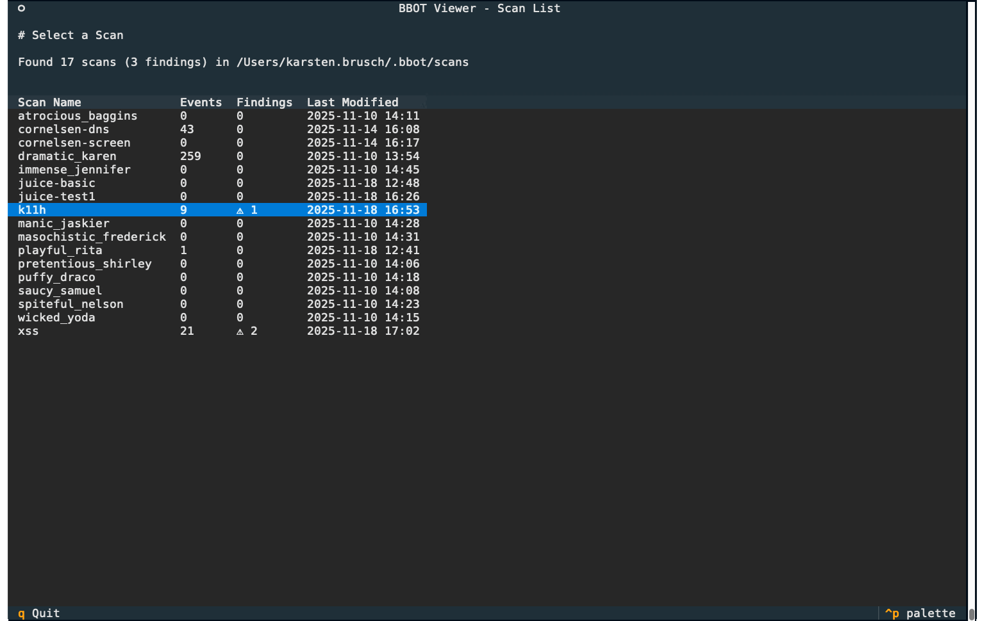

# BBOT TUI Viewer

A self-contained terminal UI for browsing and analyzing [BBOT](https://www.blacklanternsecurity.com/bbot/) scan results.



## Features

- 🚀 **Zero Setup** - Single self-installing file, no manual dependencies
- 🔴 **Live Refresh** - Auto-updates while scans are running (NEW!)
- 📋 **Scan Browser** - Navigate multiple scans with findings count
- 🔍 **Findings View** - Dedicated tab for vulnerabilities and findings
- 🌳 **Discovery Tree** - Hierarchical view showing parent-child event relationships
- 📊 **Rich Statistics** - Beautiful tables with event distribution and scope analysis
- 🔎 **Event Explorer** - Filter, search, and inspect all scan events
- ⚙️ **Config Viewer** - View preset.yml configuration

## Quick Start

```bash
# Copy to server and run (auto-installs on first run)
./bbot-ui

# Or specify custom path
./bbot-ui /path/to/scans
```

First run creates `.bbot_ui_venv/` and installs dependencies. Subsequent runs launch instantly.

## Usage

```bash
./bbot-ui                          # Default: ~/.bbot/scans
./bbot-ui /path/to/scans          # Browse all scans in directory
./bbot-ui ~/.bbot/scans/scan-name # View specific scan
```

### Command-Line Options

```bash
./bbot-ui --help                               # Show all options
./bbot-ui --scan-interval 5                    # Refresh scan view every 5 seconds
./bbot-ui --list-interval 10                   # Refresh scan list every 10 seconds
./bbot-ui --live-threshold 30                  # Mark scans as "LIVE" if modified within 30 seconds
./bbot-ui --scan-interval 1 --live-threshold 5 # Fast refresh with tight live detection
```

**Available options:**
- `--scan-interval SECONDS` - Refresh interval for scan detail view (default: 2.0)
- `--list-interval SECONDS` - Refresh interval for scan list view (default: 3.0)
- `--live-threshold SECONDS` - Age threshold to mark scans as "LIVE" (default: 10)

Settings are automatically saved to `~/.bbot_ui_config.json` and used as defaults for future sessions.

## Interface

### Scan List
- Browse all scans with event/findings counts
- ⚠ indicator shows scans with vulnerabilities
- **● LIVE** indicator (green) shows actively running scans
- Auto-refreshes every 3 seconds to show new scans and updates
- `↑/↓` or `j/k` to navigate, `Enter` to open, `r` to refresh manually

### Scan Viewer Tabs

- **Status Bar**: Shows **"● LIVE"** (green) when scan is actively updating, with real-time event count
- **Auto-refresh**: All tabs update every 2 seconds when new events are detected
- Press `r` to refresh manually and see notification with new event count

**1. Findings** - Vulnerabilities and findings with severity, host, description (live updates)
**2. Events** - All events with type filter, scope distance filter, multi-term search, and JSON details (live updates)
**3. Tree** - Two view modes (live updates):
   - **Discovery**: Shows how events were found through scan modules (parent-child relationships)
   - **Topology**: Logical network hierarchy (IP_RANGE → IP → OPEN_TCP_PORT)
**4. Statistics** - Event distribution, top 15 modules (ranked), scope distance charts (live updates)
**5. Configuration** - Syntax-highlighted preset.yml

## Multi-term Search

The Events tab supports powerful multi-term search:

- **Space-separated terms**: Use spaces to search for multiple terms (e.g., `httpx in-scope`)
- **AND logic**: Events must match ALL terms to appear in results
- **Fields searched**: data, type, module, host, tags, discovery_context
- **Combine with filters**: Works together with Type and Scope distance filters

Examples:
- `httpx in-scope` - Events from httpx module with in-scope tag
- `k11h HIGH` - Events related to k11h.de with HIGH severity
- `nuclei VULNERABILITY` - Vulnerabilities discovered by nuclei module

## Keyboard Shortcuts

**Navigation**: `↑/↓` or `j/k` | **Switch tabs**: `Tab` | **Search**: `f` | **Refresh**: `r` | **Adjust split**: `←/→` | **Back/Quit**: `q` or `Escape`

## Live Refresh

bbot-ui automatically detects and displays updates from running scans in real-time:

### Features
- **Incremental loading**: Efficiently reads only new events from `output.json`
- **Auto-detect**: Marks scans as "LIVE" if modified recently (configurable threshold)
- **Non-blocking**: UI remains fully responsive during updates
- **Cursor preservation**: Maintains your position in tables during refresh
- **Graceful handling**: Skips incomplete/malformed JSON lines
- **Configurable intervals**: Customize refresh rates for your needs

### Configuration

You can customize the live refresh behavior:

**Via command-line:**
```bash
./bbot-ui --scan-interval 5 --list-interval 10 --live-threshold 30
```

**Defaults:**
- Scan detail view refreshes every **2 seconds**
- Scan list view refreshes every **3 seconds**
- Scans are marked "LIVE" if modified within **10 seconds**

**Use cases:**
- **Fast networks/local scans**: Use shorter intervals (e.g., `--scan-interval 1`)
- **Remote/slow systems**: Use longer intervals (e.g., `--scan-interval 5`)
- **Long-running scans**: Increase live threshold (e.g., `--live-threshold 30`)
- **Reduce CPU usage**: Increase all intervals for less frequent checks

Settings are saved to `~/.bbot_ui_config.json` and persist across sessions.

## Troubleshooting

**Setup didn't complete properly?**
```bash
rm -rf ~/.bbot_ui_venv && ./bbot-ui
```

**No output.json found?**
Ensure scan directory contains `output.json` (BBOT generates this automatically)

**Python not found?**
```bash
# Ubuntu/Debian
sudo apt install python3 python3-venv

# macOS
brew install python3
```

## Requirements

- Python 3.8+
- Auto-installs: textual>=0.47.0, rich>=13.0.0

## Tips

- Viewer limits display to 1000 events; use filters for large scans
- Delete `~/.bbot_ui_venv/` to force clean reinstall

## License

MIT
